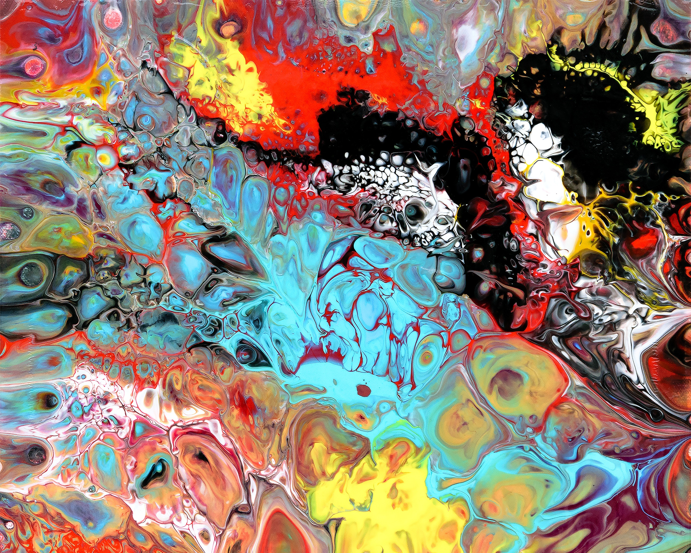

# Style-Transfer
This script has been inspired by this [tutorial](https://www.tensorflow.org/beta/tutorials/generative/style_transfer){:target="_blank"}. The script allows for command line arguments and also for saving your new image (this didn't work for me in the code provided in the [tutorial](https://www.tensorflow.org/beta/tutorials/generative/style_transfer){:target="_blank"}).
## Prerequisites
I strongly encourage you to use tensorflow-gpu because it is so much faster than its cpu counterpart.
```
pip install -q tensorflow-gpu==2.0.0-beta0
```
You would also need matplotlib and numpy
```
pip install matplotlib, numpy
```
## How to use?
The script has 6 inputs (2 are mandatory):
- -i or --input= &emsp; path_to_file_on_which_style_will_be_applied (***mandatory***)
- -s or --style= &emsp; path_to_style (***mandatory***)
- -d or --max_dim= &emsp; maximum image dimension your graphics card can process at a time (trial and error);  
(if you want to process a bigger picture just split it up in multiple smaller ones)
- -e or --epochs= &emsp; how many epochs of 100 steps you want your picture to undertake (more epochs more time but better results)
- -a or --input_weight= &emsp; how much the input weights in regards to the style (input>style => input will be preserved better)
- -b or -style_weight= &emsp; how much the style weights in regards to the input 

```
python create_new_image.py -i Photo.jpg -s style.jpg -d 1200 -e 5
```

## Example
For the input, I will use a picture I took on my vacation in Italy. The style will be an abstract picture I found on [Unsplash](https://unsplash.com/?utm_source=unsplash&utm_medium=referral&utm_content=creditCopyText){:target="_blank"} made by [Lønfeldt](https://unsplash.com/@artbylonfeldt?utm_source=unsplash&utm_medium=referral&utm_content=creditCopyText){:target="_blank"}.

#### Input

#### Style

#### Output

